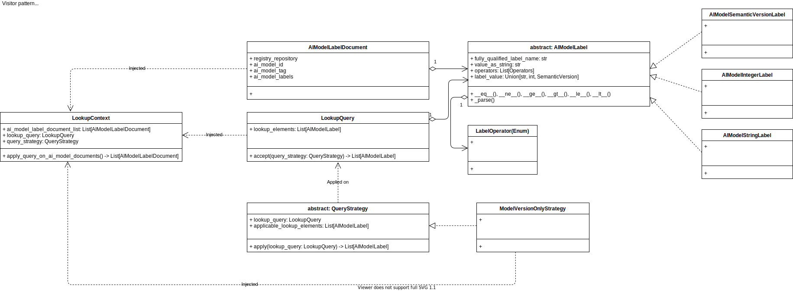

## Feature Model Lookup
The feature of model lookup enables matching query requests on a given set of AI models (their metadata). Enabling model lookup, one can filter available AI models against Zeiss Meditec and medical-specific search and lookup criteria.

### Application Concept
The following domain model concepts have been applied to implement AI model lookup feature:

The following conceptual elements are present:

- LookupContext: Aggregate containing available AIModelLabelDocuments, the LookupQuery, the QueryStrategy
- LookupQuery: Input query and filter elements for executing a filtering and matching of AIModelLabelDocuments
- QueryStrategy: A strategy how to filter the AIModelLabelDocuments
- AIModelLabelDocument: Base metadata structure for AI models and its AIModelLabels
- AIModelLabel: Type of AI model metadata label (e. g. SemanticVersion, Integer, String, etc.) 