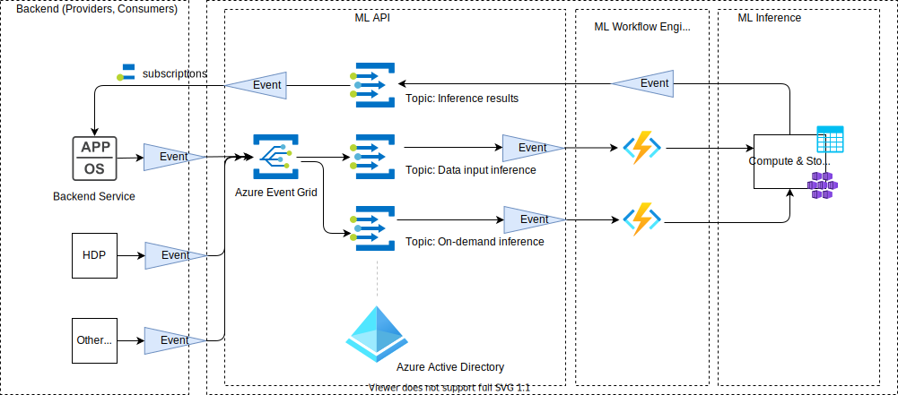

# Overview

The MLware solution prodvides infrastructure and processes for AI inference. The solution design for AI inference and core concepts are presented here.


## Interaction Flow

1. Medical and personal data ingestion into HDP
2. Creating inference event including data input metadata, data reference for algorithm selection and execution (2a = data-source-triggered, 2b = AI-product-triggered)
3. Triggering Azure Functions process by data inference event
4. Lookup and matching of AI algorithm based on data input metadata and AI algorithm metadata
5. Invoking selected AI algorithm with data input reference
6. Data access through AKS-deployed container
7. Inference results stored in Azure storage
8. Creating inference results event for inference consumers with data reference
9. Inference results consumption by AI application backend
10. HDP data consumption by AI application backend, using data reference
11. Visualization of content within web application
12. Ad-hoc lookup of AI algorithms to be listed in AI application
13. AI Product Application backend interaction with data store and state management


## Inference

### ML Workspace

Supporting model management is a key aspect required across ML training and inference, therefore the Azure-native ML feature for model management in Azure ML is used. Azure ML deployment artifacts are constraint to a specific execution environment (Python, Ubuntu), therefore model packaging and provisioning support for both options will be supported:

- Azure ML model packaging and provisioning
- Azure Container Registry pre-built docker image packaging and provisioning

Azure ML and Azure Container Registry serve as model registries for model lookup (based on model metadata).

### Serverless microservices

ML API and ML workflow functionality is provided in form of serverless (Azure Funtions) microservices.

### ML Inference

Inference is executed on Azure compute targets dedicated for pre-production (Azure Container Instances) or production (Azure Kubernetes Services) purposes. The deployed artifacts are docker images leveraging container technology.

#### Inference Results

##### Document Storage
Inference results are stored as documents in a document storage (Azure Cosmos DB), since inference results per default are generated as AI model specific json documents:


The Cosmos DB account is named as, e. g.:
- cdb = Cosmos DB resource
- mlwareinference = application
- dev = environment
- westus = region
- 001 = instance number

A Cosmos DB container serves for grouping AI inference results belonging to the same AI concern (e. g. AI product). This allows for RBAC on container level, isolating the concerns of different AI products, from a security, but also data perspective. Therefore, a Cosmos DB container can contain inference results of inference results based on one ore many AI models belonging to **one logical isolated AI product**.

The Cosmos DB containers are named as, e. g.:
- cdbcontainer = Cosmos DB container resource
- basiccare (aiproduct) = bucket for inference results of a specific AI class
- 1 = instance number

Partitioning of documents is done based on patient ID (partitioning key is the patient ID), in order to ensure equal logical distribution of documents on physical Cosmos DB partitions.

##### Security for Inference Data Access
Since documents are segregated based on AI product concern on Cosmos DB container level, RBAC is applied to grant read-only access to AI products requesting access to inference results.

Another option of Cosmos DB to be used in sepcific contexts: authorization of inference access requests using resource tokens as permission artifact. Those resource tokens are authorization tokens and are configured the way:
- read access only to inference results
- read access to a specific document only containing the inference results
- default TTL (time-to-live) of authorization token: 15 minutes

##### Permissions
Permission on container-level:
``` 
{
    "RoleName": "InferenceResultsReadWriteRole",
    "Type": "CustomRole",
    "AssignableScopes": ["/"],
    "Permissions": [{
        "DataActions": [
            "Microsoft.DocumentDB/databaseAccounts/readMetadata",
            "Microsoft.DocumentDB/databaseAccounts/sqlDatabases/containers/items/*",
            "Microsoft.DocumentDB/databaseAccounts/sqlDatabases/containers/*"
        ]
    }]
}
```

### Event-driven Inference

Inference processes are technically invoked as events in an event-based mechanism (Azure Event Grid). Inference results are published in an event-based manner.



### Data Lifecycle Management

GDPR and other regulations enforce operationalization of data liefecycle management processes. The given technical solution using Azure Datalake Storage (based on Azure Blob Storage, with add-on features for hierarchical ) addresses main aspects required in context of data management (for inference data):

- Authenticated and role-based access to inference data (Azure RBAC)

- Traceable data collection (Azure Monitor and Azure Storage Logs, CRUD operations on blobs)

- Retention, deletion, and compliance rules for inference data: 
    - using Azure Blob hot, cool, archive tiers (access tiers)
    - using Blob policies when to delete, when to archive data (policies)