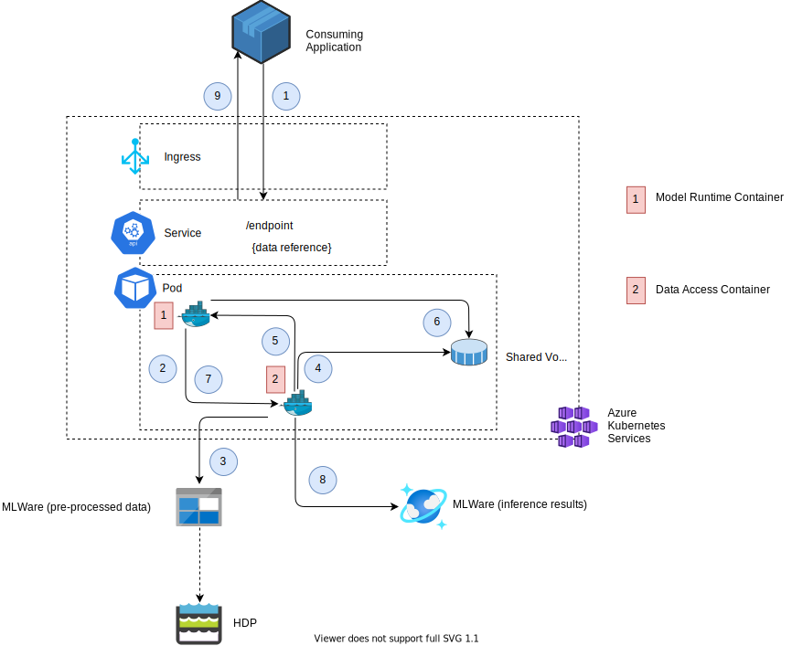

# Stages
This section describes the stages used for deployment of MLware platform. Basically, the MLware platform is deployed to pre-production stages (environments) first to cover testing/QA concerns before rolling out to production stage.

## Development stage
The initial stage is the development stage, which is exclusively used for initial integration tests triggered by development team. It serves the purpose of efficiently checking newly developed features in an integrated MLware platform. This is the most unstable stage compared to other subsequent stages.

## QA stage
The QA stage is the integration and system testing stage and serves the purpose of checking the operation of MLware platform as a whole. It could be used for MLware platform external integration tests as well.

#### Clinical Trial Stage
This stage focuses most on ensuring a certain level of clinical/medical quality of the AI model soluton before getting publicly released. This concern is similar to where AI solutions need to be validated against a certain AI-quality level.

## Production stage
The production stage is the final stage offering the Mlware platform features to platform-external consumers. For production releases, a set of End-to-End Tests need to be specified and executed.

### Kubernetes

#### Deployment

#### Data Access

#### Inference Results

#Cosmos DB creation under MLware

 IaC specification for storage (Cosmos DB) has created using Terraform and codes maintaining under the source-controlled. Azure Cosmos DB provisoned with private endpoint.

#Expose Azure kubernetes with Cosmos DB with Private connection

 Cosmos DB is enabled with private endpoint and hosted behind the Virtual network. And also Comsos DB and AKS connection has been established and verified by using Curl -v from AKS.

#Azure Devops Pipeline creation for Automatic AKS and Cosmos DB deployment using Iac (Terraform)
 Azure pipeline has been created which takes care of Provisioning the Cosmos DB along with Containers and Azure Kubernetes service. To find out the code from the below location. Runtime value for terraform execution as been passed through respective environments .tfvars files   
- Repo Name : iaa-infra
- path : terraform/mlware/cosmosdb.tf, terraform/mlware/cosmosdb-containers.tf
    
#Provisioning the azure resources by implementing Staged approach.
Azure pipeline has been created with stages with secrity/Checks and approval for neccessary environemnt deployments.
