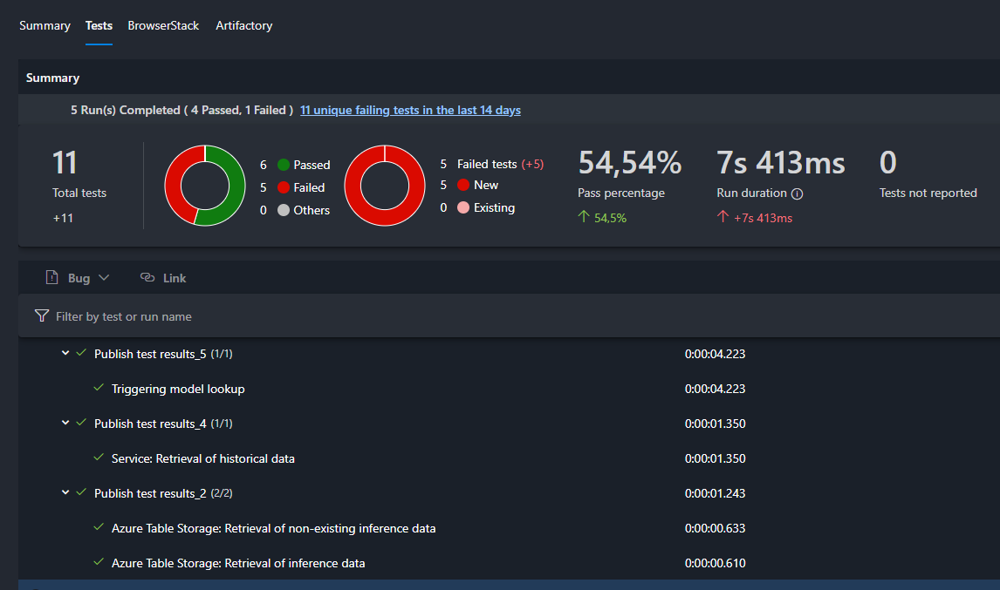

[[_TOC_]]

# Overview
Quality assurance is an integrated part of implementing solutions including Machine Learning (ML) and Software Engineering (SE). This section gives a high-level overview of relevant QA and test scopes with reference to to AI artifact lifecycle (AI training and inference).

# Quality Assurance Principles
The purpose of ML and SE quality assurance is to create transparency of the quality level of a solution and enbaling safe and efficient refactorings/extensions of an existing solution. The QA artifacts and tests need to be highly automated (execute automatically as part of CI/CD pipelines).

# ML and SE Quality Assurance
The scope and focus for AI/ML-based solutions with respect to QA and testing is not different to other IT-areas, so that the rule of thumb principles of the [test pyramid](https://martinfowler.com/articles/practical-test-pyramid.html#TheTestPyramid) are applicable.

## Training Focus
Focus of QA and testing in the training phase is mainly on application code unit testing and ensuring the prediction quality of AI/ML models.

### Unit Testing
The training phase of an AI solution requires to implement training application code that needs to be covered by unit tests. This aspect covers 2 major concerns:
- Early QA of application code that produces a deployment artifact (AI model) getting rolled-out to a production environment
- Data Scientist is getting quick feedback about the testability of training application code and if the application code is modularized in a good way to be efficiently tested

### Model Metrics and Model Management
A second, but AI-specific QA concern is the evaluation and tracking of AI model metrics. Tracking the quality of AI models requires to register metrics with model management (e. g. Azure ML model management).

## Inference Focus
Focus of QA and testing in the inference phase is on application unit testing and integration/system testing of the MLware platform.

### Unit Testing
For inference application code, it is even more important to have a relevant code coverage, when it comes to unit tests. This enables transparency about application code quality for inference and enables efficient and safe changes when needed.

### Integration Testing
Inference applications are integrating with other system components like microservices or 3rd-party applications, persistence components (databases), but usally also offer a web (REST) API for client-side integrations. These integrations need to be tested explicitly, best in an automated way, as soon as the interfaces are sufficiently stable.

#### Testing Integrations
Integration Testing focuses on checking the combination of two or more system components. These combinations could be (no complete list):
1. Microservice application and persistence resource
2. Microservice application and MLware platform external application
3. Microservice application and other microservice application


Testing these combination requires the components to be actually deployed and up and running, as well as specified and implemented tests.

#### Integration Testing framework
In order to implement Integration Tests, a framework needs to be used to specify, implement and execute those tests. The framwork used to implement Integration Tests for MLware platform leverages the initial idea of [Behaviour Driven Development (BDD)](https://behave.readthedocs.io/en/stable/philosophy.html), which enables developers and business-side colleagues to read and understand the intention of an Integration Test. However, we use the concept of BDD to not only cover and specify business features, but also to specify technical Integration Tests.

The framework implementation used in context of Mlware platform is named [behave](https://behave.readthedocs.io/en/stable/index.html), which enables specification of tests as well as (automated) execution of those tests as part of Azure DevOps pipelines.

#### Features and Scenarios Specification: Gherkin Language
Using BDD, the Integration Tests are specified in form of Scenarios, with a Given-When-Then structure, analog to best-practices structure of unit tests.

**Example:**

```
Feature: Orchestration and Workflow Engine

Scenario: Triggering orchestration service
    Given Service orchestration configuration is initialized
    When Sending a model lookup request
    Then Orchestration request is successful
```

A feature covers normally a certain larger test aspect (e. g. larger system scope) and scenarios cover specific integrations/flows to test.

#### Integration Tests Execution and Automation
The specified integration tests (see [Features and Scenarios Specification: Gherkin Language](#features-and-scenarios-specification:-gherkin-language)) are getting executed automatically (as Python behave tests) as an Azure DevOps pipeline with each merge into the develop branch. A subset (or all) of integration tests are executed against all environments (dev, qa, stage, production, etc.).

Including the integration test suite into any Azure DevOps pipeline is implemented using a pipeline template as:

```
...

jobs:
...

  - template: ../templates/integration-tests/integration-tests-inference-job-template.yml
    parameters:
      bahaveTags: 'runall' # 'runall' for executing all tests, or add behave tags as documented https://behave.readthedocs.io/en/stable/behave.html#tag-expression
      environment: 'dev' # add environment value as 'dev', 'qa', 'prod'
...
```

#### Test Report

The Azure DevOps pipeline produces a test report for failed and passed tests. This happens automatically as part of a pipeline run.



A dashboard (Azure DevOps) can be found [here](https://dev.azure.com/ZEISSgroup-MED/GEN_Health_Data_Platform/_dashboards/dashboard/cc916cb8-7f08-4953-850e-5322750442f6) summarizing the platform quality from integration/system test perspective.