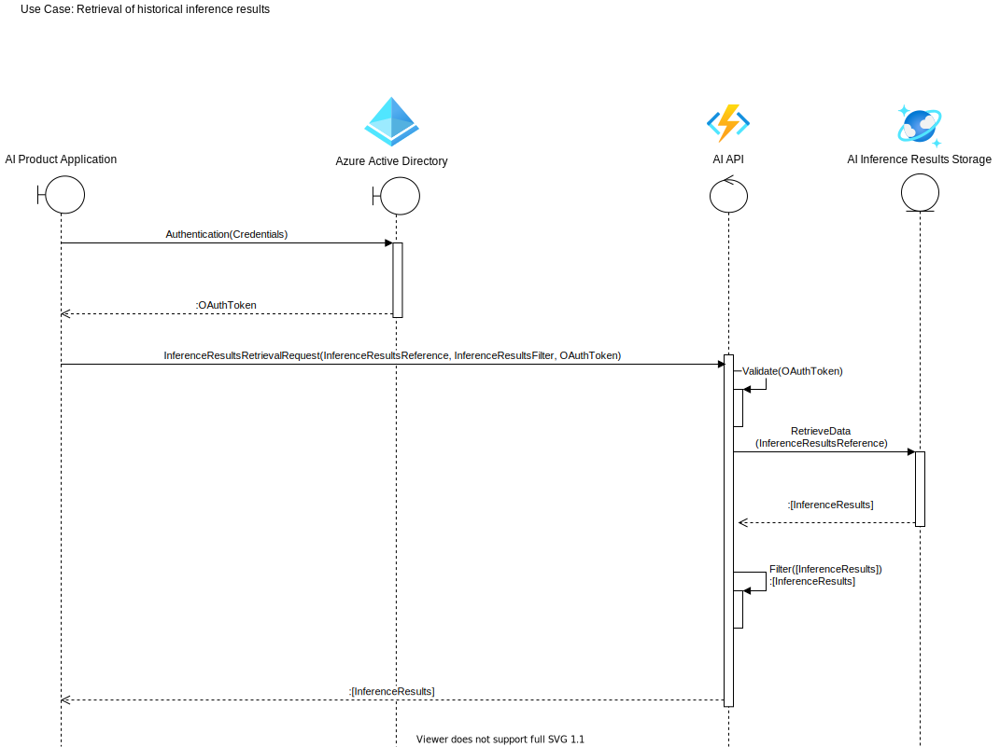

# Overview

# Use Cases

## Application-triggered inference and retrieval of inference results by application
This use case enables applications (AI product applications) to trigger inference processing within MLware platform and retrieve inference results. The inference trigger is asynchronously decoupled from inference results retrieval.

## Retrieval of historical inference results by application
This use case enables applications (AI product applications) to retrieve inference results created in the past (historical inference results).

