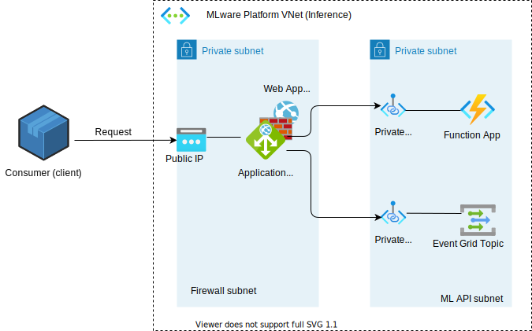

[[_TOC_]]

## Network security

### Virtual Private Networks
All MLware Azure resources are included within a VNet with per default non-public internet connectivity.

### Network Security Groups
Network communication rules and (internal) segmentation are getting applied on subnet or multi-subnet level, network-level access granted on a needs basis, as communication flow shown in overall solution design [system overview](../../Architecture-and-Design/ML-BasicCare-ODx-Solution-Design.md).

The following internal boundaries exist (see light-blue subnets in diagram):
- api (VNet-external connectivity to other VNets, private subnet, perimeter control): MLware-VNet-external network traffic is individually granted and per default rejected
- ingest (VNet-external connectivity to other VNets, private subnet, perimeter control): MLware-VNet-external network traffic is individually granted and per default rejected
- orchestrate (only VNet-internal communication allowed, private subnet, internal segmentation)
- execute (only VNet-internal communication allowed, private subnet, internal segmentation)
- workspace (only VNet-internal communication allowed, private subnet, internal segmentation)

### Private Endpoints
Azure resources to be exposed per default using private endpoints.

As part of the solution design, the following resources must be setup to offer only private endpoints using private dns zones, behind a virtual network (using Azure Private Link):
- Azure ML Workspace
- Azure Storage resources: Blob Storage, Cosmos DB, etc.
- Azure Key Vault
- Azure Kubernetes Services
- Azure Container Instances
- Azure Compute Instance (ML, Managed Resources), Virtual Machines
- Azure Compute Cluster (ML, Managed Resources), Virtual Machines
- Azure Event Grid
- Azure Functions

### Firewalls

#### Azure Application Gateway
For all ingress traffic (into MLware VNets), an application gateway (including web application firewall) is checking network traffic, for web/public internet access.

The public access to MLware platform is protected by Azure Application Gateway:

 

### Kubernetes network policies
Work item: #373566

Azure Kubernetes Services is used as an AI model runtime environment, for multiple tenants, while AI model applications are deployed as kubernetes pods. Therefore, pod-level network isolation is required to ensure AI model application isolation. Kubernetes network policies applied:
- **egress policy** per default (policyTypes): 
  - allowed egress connections to the requesting Azure Function microservice
- **ingress policy** per default (policyTypes): 
  - allowed inbound connection from requesting Azure Function microservice

An Azure Gateway Ingress Controller is used for kubernetes external-traffic management.

### Bastion host
An Azure Bastion host (jump host) for administration connectivity from specified sources is used. The Bastion host is part of the ML Workspace VNet.