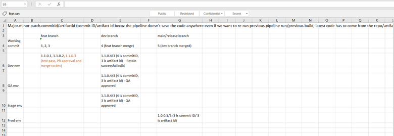
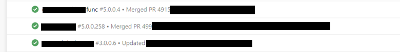

# Build Number Standardization

# Table of Contents
- [Table of Contents](#table-of-contents)
    - [Terraform build number standard](#terraform-build-number-standard)
    - [Application build number standard](#application-build-number-standard)

# Terraform build number standard
This section gives an overview of versioning or build number standard for the Terraform releases/deployments which can be generated and tracked via Azure pipelines

# Problem Statement
There are no set rules defined to save the artifact of the terraform code due to which it is difficult to track or revert back to a certain deployed version of the code. Below are 2 approaches analyzed to resolve the issue and set standards that fits our requirement.

## Solution Approach 1 
Following the similar version number standards as applicable for application

### Version Number Issuance
The following scheme would be followed to generate build number:
<major>.<minor>.<patch>.<buildnumber>

Below are the definition for each component
- <major> is incremented for a release with major enhancements relative to the previous release. For eg; Adding a new service within the architecture such APIM, gateway etc, change API endpoint name or signature, remove an endpoint etc.
- <minor> is incremented for a release with enhancements of features or adding new feature to the existing services or endpoint declared deprecated.
- <patch> is incremented for a release for bug fixes, performance improvement, environment or internal tweaks or a maintenance release to deal with parts obsolescence or other minor issue.
- <buildnumber> is incremented with every pipeline run. 

### Implementation
Rewrite the pipeline as below 
1.	Remove the terraform plan step from Terraform validate and plan which is after checkov
2.	Add terraform plan step individually to the respective environments (deployment section). Eg. Deployment – dev (initialize job, download artifact, terraform init, terraform plan and soon), Deployment – QA (initialize job, download artifact, terraform init, terraform plan and soon)
The plan step would include:
1. Download the artfiact
2. Extract to temp location
3. Run terraform plan on extracted code
4. Run terraform apply on extracted code
5. Remove temporary code

.png)

Pros:
- It will work like the application versioning where all the environments added to a pipeline will use same artifact.
- Reduces complexity for build numbering and tagging/saving it.
- Each environment will have its own plan to deploy while code base remains same

Cons:
- Cannot be tagged or track service-wise on Azure

OR

### Using release pipelines from Azure DevOps

.png)

## Solution Approach 2
Versioning the build number in the below format replacing the <buildnumber> to <commitId>.
<major>.<minor>.<patch>.<commitId>

Below are the definition for each component
- <major> is incremented for a release with major enhancements relative to the previous release. For eg; Adding a new service within the architecture such APIM, gateway etc, change API endpoint name or signature, remove an endpoint etc.
- <minor> is incremented for a release with enhancements of features or adding new feature to the existing services or endpoint declared deprecated.
- <patch> is incremented for a release for bug fixes, performance improvement, environment or internal tweaks or a maintenance release to deal with parts obsolescence or other minor issue.
- <commitId> is auto generated hash number from every commit done on to the repo.

All numbers (<major>, <minor>, <patch>) are integers without leading zeros while the commit Id will be alphanumeric copied from repo commits.
Example: 1.0.0.b12e78

Note: For internal and technical identification of the exact release/deployment that created the build 
number is extended with the commit id following the scheme: <major>.<minor>.<patch>.<commitId>.

The commit Id has been introduced to entertain fall back scenarios where a certain build is required to be reverted/deployed due to some issues or managerial decision.

### Implementation
In case of reverting a build is required, following would be the steps
- Take the build number of successful run and pick out the commit ID from it (Note: Save the build number of successful run and the run has to be retained)
- Take a clone/ checkout to that particular commit id
- Create a new branch from that commit id
- Create pull request for an approval or track purpose if time permits else deploy/run the pipeline using the new branch to revert back

Pros:
•	All the deployment or major deployments can be tracked easily
•	The code for a particular build can be easily accessible/referred from the repo using the commit id.
•	No extra space required to save the code

Cons:
•	Documenting the successful build is required for the track.
•	Following the given steps can be time consuming and erroneous.

# Application build number standard
This section gives an overview of versioning or build number standard for the application releases/deployments which can be generated and tracked via Azure pipelines

# Version number Issuance
The following scheme would be followed to generate build number:
<major>.<minor>.<patch>.<buildnumber>

Below are the definition for each component
- <major> is incremented for a release with major enhancements relative to the previous release, new features impacting more than one module. 
- <minor> is incremented for a release with enhancements of existing features or additional feature including safety relative to the previous release. 
- <patch> is incremented for a release with only defect corrections or bug fixes, a maintenance release to deal with parts obsolescence or other minor issue.
- <buildnumber> is incremented with every pipeline run. 

All numbers (<major>, <minor>, <patch>, <buildnumber>) are integers without leading zeros.
Example: 1.0.0.1

Note: For internal and technical identification of the exact build that created a product version, the version number is extended with the build number. 

- How build number is incremented?
- The build number is incremented with every run of the pipeline. Suppose the pipeline ran for the first time, the numbering would be 1.0.0.1 where '1' is major, '0' is minor, next '0' is patch and the last '1' is the number of times the pipeline ran till now; Now lets run the pipeline again without making any code changes, so this time numbering would be 1.0.0.2, the last number has been incremented by 1 and similarly it will increment with every run.
