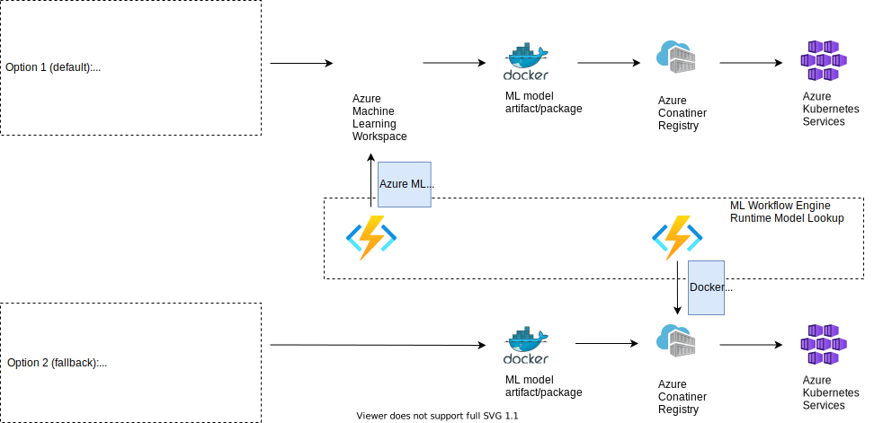

## AI Model Deployment Classes
There are two main classes of AI model artifacts that need to be covered with two separate deployment processes. The two approaches differ in its flexibility to use different AI model runtimes and support for MLOps processes.

### Pre-built AI package
Option 2 in [Deployment Options](../.attachments/inference_deployment_options_model_lookup.svg) is providing the possibility to deploy any kind of AI model artifacts (provided as docker image) in Azure infrastructure (in production: Azure Kubernetes Services). This gives most flexibility for model owners to design their model runtime environment. Along with AI model artifacts, model metadata is registered as labels for model lookups. The model registry is implemented as Azure Container Registry.

### Azure ML -built AI package
Option 1 in [Deployment Options](../.attachments/inference_deployment_options_model_lookup.svg) is providing the possibility to deploy AI model artifacts in Azure infrastructure (in production: Azure Kubernetes Services) leveraging the capabilities of Azure Machine Learning feature set. This gives integrated support for MLOps processes (AI training, deployment, data and model management, etc.) to model owners. Along with AI model artifacts, model metadata is registered as tags for model lookups in Azure Machine Learning Workspace. The Azure Machine Learning Workspace provides model registry capabilities in that case.

## Technology
Automation processes for CI/CD is covered and implemented using Azure DevOps platform.

## Approval
Approval processes are implemented as part of stages in Azure DevOps pipelines.

## Infrastructure as Code (IaC)
All infrastructure specification is realized using Infrastructure as Code. Tooling-wise Terraform has been selected to specify, plan, and deploy IaC artifacts.

## Region-Specific Deployments
Respecting regulatory constraints, the provisiong of Azure infrastructure needs to comply with a regional approach. E. g. data that is geographically and legally bound to one country, needs to be stored, operated, and processed on Azure infrastructure in the same physical geography/region.

The deployment approach for Azure accounts for this requirement, enabling region-specific setups and deployments.

