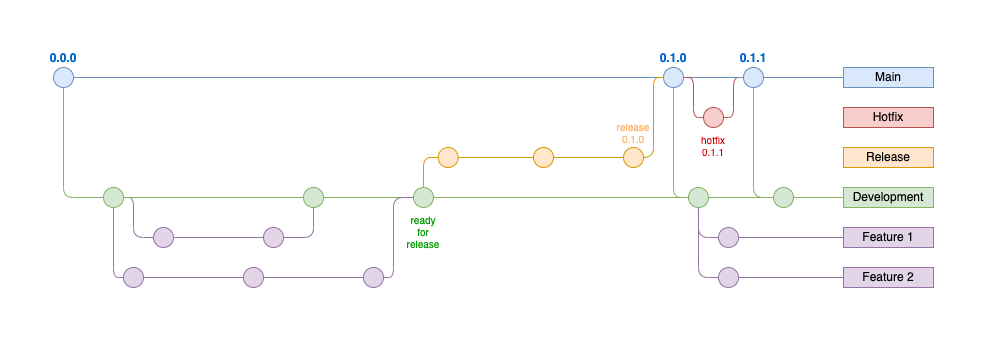

# Branching strategy

In git, there are 4 types of branches: 
- The **main** branch: This is the branch that represents the state of the production environment
- The **development** branch: This branch is used for development, so it should represent the state of DEV and QA.
- **Feature** branches: Those branches are used to develop new features and should always be created from the "development" branch
- The **release** branch: When the development branch is released, the release branch can be used to fix bugs, merge conflicts, etc. without new changes being added by other developers.
- The **hotfix** branch: If a hot fix needs to be deployed to the main branch, then a hotfix branch can be used in order to avoid going through a release process.

In the following figure, there is an example of branch creations based on new features, releases and hot fixes. 

# Release strategy

Whenever a new version is deployed (this should happen at least every 2 Sprints), the following steps should be applied:
1. Make sure that each feature branch with code to be deployed is merged in the development branch.
2. Create a release branch out from the "development" branch with a new version tag 
3. Fix bugs and merge conflicts on the release branch
4. Merge the main branch back into the develop branch
5. Merge the release branch into the main branch
6. Delete the release branch

# Environments

TODO: Add a description/image describing our environment setup.
Mapping from branches -> (subscriptions -> resource group).

# Continuous Integration & Continuous Deployment

### Deployment Triggers
- The deployment to DEV can be done...
    - ... from a feature branch to test a functionality
    - ... from the develop branch to get the latest develop state in DEV.
- When a feature branch gets merged into the deployment branch, the pipeline for deploying the infrastructure to the QA environment should be triggered automatically.
- When the deployment branch gets merged into the main branch, the pipeline for depyloying the infrastructure to the Stage environment should be triggered automatically.

### Build once, deploy to the stages
The continuous deployment strategy should build the artifacts once and deploy them to the different stages. A release process should work as follows:

1. Build and deploy to DEV
2. Deploy the build artifact from 1. to QA
3. Deploy the build artifact from 1. to Stage

## Deploy a new environment

follow the steps in the [terraform wiki page](https://dev.azure.com/ZEISSgroup-MED/GEN_Health_Data_Platform/_wiki/wikis/AIXS%20Platform%20Documentation/9419/Terraform?anchor=execution-of-terraform)
