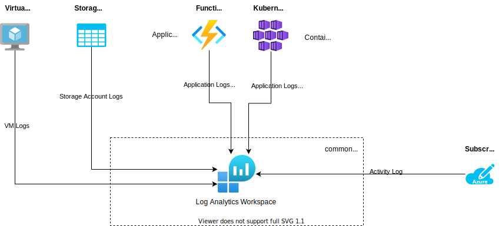

# Overview
This section provides an overview of the basic logging concepts applied for MLware platform.

# Log Management
Centralized logging is applied for log management using Azure Log Analytics Workspace.

For inference context and infrastructure, there will be one single Azure Log Analytics Workspace used. All infrastructure resources for inference must link to this Log Analytics Workspace.

## Log Types
The following log types are basically relevant for being captured:
- Azure default infrastructure logs for Virtual Machines, Storage Accounts
- Subscription activity logs
- Application logs for Azure Functions and Azure Kubernetes Services
- Azure default telemetry logs for Azure Functions and Azure Kubernetes Services
- Custom telemetry logs for Azure Functions and Azure Kubernetes Services

## Application Logs
Application logs are commonly pushed to stdout (Azure Functions and Azure Kubernetes Services) - when Application/Container Insights activated - and being forwarded to the Log Analytics Workspace.

## Custom Telemetry Logs
Custom teleemtry logs can be created and pushed using [OpenCensus](https://docs.microsoft.com/en-us/azure/azure-monitor/app/opencensus-python) in Python framework. The Python application needs to be instrumented accordingly.