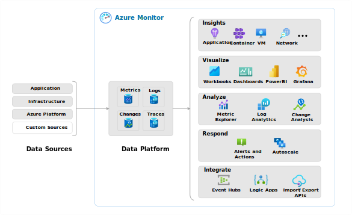
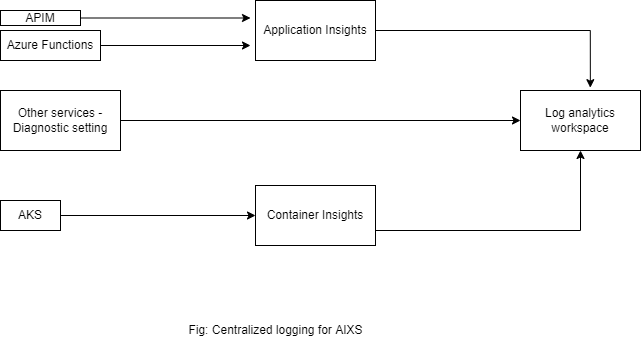
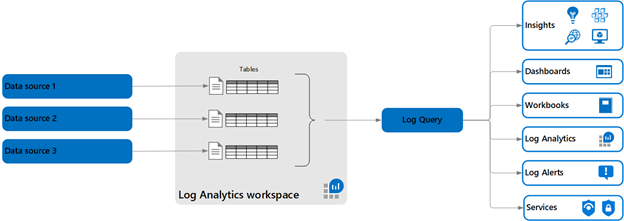

# Observability achieved in Azure
Enabling observability across today's complex computing environments running distributed applications that rely on both cloud and on-premises services, requires collection of operational data from every layer and every component of the distributed system. 
You need to be able to perform deep insights on this data and consolidate it into a single pane of glass with different perspectives to support the multitude of stakeholders in your organization.

Metrics, logs, distributed traces, and changes are commonly referred to as the pillars of observability. These are the different kinds of data that a monitoring tool must collect and analyze to provide sufficient observability of a monitored system.

## Metrics
Metrics are numerical values that describe some aspect of a system at a particular point in time. They are collected at regular intervals and are identified with a timestamp, a name, a value, and one or more defining labels. 
Metrics in Azure Monitor are stored in a time-series database which is optimized for analyzing time-stamped data. This makes metrics particularly suited for alerting and fast detection of issues. They can tell you how your system is performing but typically need to be combined with logs to identify the root cause of issues.

## Logs
Logs are events that occurred within the system. They can contain different kinds of data and may be structured or free form text with a timestamp.
Logs in Azure Monitor are stored in a Log Analytics workspace that's based on Azure Data Explorer which provides a powerful analysis engine and rich query language. Logs typically provide enough information to provide complete context of the issue being identified and are valuable for identifying root case of issues.

## Traces
Traces are series of related events that follow a user request through a distributed system. They can be used to determine behavior of application code and the performance of different transactions. While logs will often be created by individual components of a distributed system, a trace measures the operation and performance of your application across the entire set of components.
Distributed tracing in Azure Monitor is enabled with the Application Insights SDK, and trace data is stored with other application log data collected by Application Insights. This makes it available to the same analysis tools as other log data including log queries, dashboards, and alerts.

## Changes
Change Analysis alerts you to live site issues, outages, component failures, or other change data. It also provides insights into those application changes, increases observability, and reduces the mean time to repair.
Change Analysis builds on Azure Resource Graph to provide a historical record of how your Azure resources have changed over time. It detects managed identities, platform operating system upgrades, and hostname changes. Change Analysis securely queries IP configuration rules, TLS settings, and extension versions to provide more detailed change data. Observability in azure can be achieved using Azure Monitor. 

# Azure Monitor 

Azure Monitor helps you maximize the availability and performance of your applications and services. It delivers a comprehensive solution for collecting, analyzing, and acting on telemetry from your cloud and on-premises environments.  
Azure Monitor aggregates and correlates data across multiple Azure subscriptions and tenants, in addition to hosting data for other services. Because this data is stored together, it can be correlated and analyzed using a common set of tools.

Azure Monitor include:
•	Detect and diagnose issues across applications and dependencies with Application Insights.
•	Correlate infrastructure issues with VM insights and Container insights.
•	Drill into your monitoring data with Log Analytics for troubleshooting and deep diagnostics.
•	Support operations at scale with automated actions.
•	Create visualizations with Azure dashboards and workbooks.
•	Collect data from monitored resources by using Azure Monitor Metrics.
•	Investigate change data for routine monitoring or for triaging incidents by using Change Analysis.

For more details refer Observability data in Azure Monitor - Azure Monitor | Microsoft Learn  &  Azure Monitor overview - Azure Monitor | Microsoft Learn

# Centralized logging for AIXS architecture is defined below.

|         Resource         |                  Monitoring setting                   |  Available operations  | Type of implementation |
| :----------------------: | :---------------------------------------------------: | :--------------------: | :--------------------: |
|           APIM           | Application Insights & Diagnostic settings enablement |    Metrics and logs    |          IaC           |
|     Azure functions      | Application Insights & Diagnostic settings enablement |    Metrics and logs    |          IaC           |
|  Azure storage account   |            Diagnostic settings enablement             | Metrics - Transactions |          IaC           |
|           AKS            | Container Insights  & Diagnostic settings enablement  |    Metrics and logs    |          IaC           |
| Azure container registry |            Diagnostic settings enablement             |    Metrics and logs    |          IaC           |
|      Azure keyVault      |            Diagnostic settings enablement             |    Metrics and logs    |          IaC           |
|    Azure service bus     |            Diagnostic settings enablement             |    Metrics and logs    |          IaC           |

A diagnostic setting specifies a list of categories of platform logs and/or metrics that you want to collect from a resource, and one or more destinations that you would stream them to. Normal usage charges for the destination will occur

Application Insights monitors the availability, performance, and usage of your web applications whether they're hosted in the cloud or on-premises. It takes advantage of the powerful data analysis platform in Azure Monitor to provide you with deep insights into your application's operations. You can use it to diagnose errors without waiting for a user to report them.

Container insights monitors the performance of container workloads that are deployed to managed Kubernetes clusters hosted on Azure Kubernetes Service. It gives you performance visibility by collecting metrics from controllers, nodes, and containers that are available in Kubernetes through the Metrics API. Container logs are also collected. After you enable monitoring from Kubernetes clusters, these metrics and logs are automatically collected for you through a containerized version of the Log Analytics agent for Linux.

# Log Analytics workspace

A Log Analytics workspace is a unique environment for log data from Azure Monitor and other Azure services, such as Microsoft Sentinel and Microsoft Defender for Cloud. Each workspace has its own data repository and configuration but might combine data from multiple services. 
Each workspace contains multiple tables that are organized into separate columns with multiple rows of data. Each table is defined by a unique set of columns. Rows of data provided by the data source share those columns. Log queries define columns of data to retrieve and provide output to different features of Azure Monitor and other services that use workspaces.

Note:- Table names are used for billing purposes so they should not contain sensitive information.

Reference Link- Log Analytics workspace overview - Azure Monitor | Microsoft Learn

